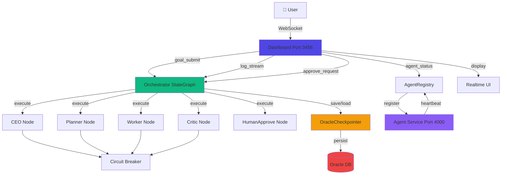

# Oracle Multi-Agent Architecture

## System Overview

Oracle Multi-Agent is an Autonomous Multi-Agent Framework built from 5 key sources:
- **Superpowers** - Workflow & Skills
- **LangGraph** - Orchestration Engine
- **PyAgentSpec** - Agent Definition
- **Soul-Brews-Studio** - Orchestration Pattern + UI
- **oracle-maw-guide** - Memory + Safety

## System Architecture Diagram

## Data Flow

### Goal Execution Flow

1. **Goal Submission**
   - User enters goal in Dashboard UI
   - Dashboard emits `goal_submit` event via WebSocket
   - Orchestrator receives goal and initializes StateGraph

2. **StateGraph Execution**
   - Orchestrator starts workflow with initial state
   - StateGraph routes to CEO node
   - CEO analyzes goal and delegates to Planner
   - Planner breaks down task and assigns to Worker
   - Worker executes task with Circuit Breaker protection
   - Critic reviews and approves/rejects
   - HumanApprove node waits for human approval if needed

3. **Checkpoint Persistence**
   - Each node saves state to OracleCheckpointer
   - Checkpointer persists to Oracle DB
   - Enables crash recovery from last checkpoint

4. **WebSocket Streaming**
   - Each node emits `log_stream` events
   - Dashboard receives and displays in Realtime Log
   - AgentRegistry broadcasts `agent_status` every 1 second
   - HumanApprove emits `approve_request` for human-in-the-loop

5. **UI Updates**
   - Dashboard updates Agent Status Cards in real-time
   - Realtime Log auto-scrolls with new entries
   - Approval Panel appears when human approval needed
   - Goal progress bar updates

### Agent Service Flow

1. **Agent Registration**
   - Agent Service starts on port 4000
   - Auto-registers with AgentRegistry every 10 seconds
   - AgentRegistry monitors heartbeat (30s timeout)

2. **Crash Detection**
   - AgentRegistry detects unresponsive agents
   - Marks agent as crashed
   - Calls agent.resume() to recover from checkpoint

3. **Circuit Breaker**
   - Each node wrapped in Circuit Breaker
   - 3 failures → OPEN state (blocks calls)
   - Cooldown period → HALF_OPEN state
   - 2 successes → CLOSED state (resumes)

## Source Attribution

### 1. Superpowers - Workflow & Skills
**URL:** https://github.com/obra/superpowers

**Files:**
- Planning phase documentation in `docs/planning/`
- RED-GREEN-REFACTOR testing methodology in `tests/`
- Skills system foundation in `core/skills/` (planned)

**Key Concepts:**
- brainstorm → write-plan → execute workflow
- TDD (RED-GREEN-REFACTOR)
- YAGNI principle
- Critique Loop

### 2. LangGraph - Orchestration Engine
**URL:** https://github.com/langchain-ai/langgraph

**Files:**
- `core/orchestrator.ts` - StateGraph implementation
- `core/state/agent-state.ts` - State management
- `core/checkpointer/oracle-checkpointer.ts` - Checkpoint persistence

**Key Concepts:**
- StateGraph pattern for agent orchestration
- Checkpoint mechanism for state persistence
- Command pattern for agent communication
- Stateful agent workflows

### 3. PyAgentSpec - Agent Definition
**URL:** https://github.com/oracle/agent-spec

**Files:**
- `agents/*.yaml` - Agent configuration files (CEO, Planner, Worker, Critic)
- `core/agentspec/agent-loader.ts` - YAML loader and validator
- `core/agentspec/agent-types.ts` - TypeScript type definitions

**Key Concepts:**
- YAML-based agent configuration
- Framework-agnostic agent definitions
- Runtime adapters
- Component-based agent composition

### 4. Soul-Brews-Studio - Orchestration Pattern + UI
**URL:** https://soul-brews-studio.github.io/multi-agent-orchestration-book/

**Files:**
- `core/orchestrator.ts` - Hierarchical Pattern (CEO → Planner → Worker)
- `dashboard/index.html` - WebSocket Dashboard UI
- `api/server.ts` - WebSocket server with socket.io
- `docs/planning/03-orchestrator-pattern.md` - Pattern documentation

**Key Concepts:**
- Hierarchical Pattern for orchestration
- Dashboard WebSocket streaming (not polling)
- Goal input, Realtime log, Agent status cards, Approve button
- Human visibility and control

### 5. oracle-maw-guide - Memory + Safety
**URL:** https://github.com/the-oracle-keeps-the-human-human/oracle-maw-guide

**Files:**
- `core/agent-base.ts` - MAW Lifecycle (Init, Active, Sleep, Blocked, Crash, Resume)
- `core/circuit-breaker.ts` - Circuit Breaker implementation
- `core/agent-registry.ts` - Auto-register and crash detection
- `docs/planning/04-maw-lifecycle.md` - Lifecycle documentation

**Key Concepts:**
- MAW Lifecycle states
- Circuit Breaker for safety
- 3-layer Memory system (planned for Oracle DB)
- Auto-register every 10 seconds
- Crash recovery from Checkpoint

## Component Mapping

### Core Components

| Component | Source | File | Purpose |
|-----------|--------|------|---------|
| Orchestrator | LangGraph + Soul-Brews | `core/orchestrator.ts` | StateGraph-based workflow orchestration |
| OracleCheckpointer | LangGraph + MAW Guide | `core/checkpointer/oracle-checkpointer.ts` | State persistence in Oracle DB |
| AgentBase | MAW Guide | `core/agent-base.ts` | Abstract base with MAW Lifecycle |
| CircuitBreaker | MAW Guide | `core/circuit-breaker.ts` | Safety mechanism for agent execution |
| AgentRegistry | MAW Guide | `core/agent-registry.ts` | Auto-register and crash detection |
| AgentLoader | PyAgentSpec | `core/agentspec/agent-loader.ts` | Load agents from YAML files |
| DashboardServer | Soul-Brews | `api/server.ts` | WebSocket server for dashboard |
| Dashboard UI | Soul-Brews | `dashboard/index.html` | Real-time monitoring UI |

### Agent Configurations

| Agent | Source | File | Role |
|-------|--------|------|------|
| CEO | Soul-Brews | `agents/ceo.yaml` | Overall strategy and task delegation |
| Planner | Soul-Brews | `agents/planner.yaml` | Task decomposition and planning |
| Worker-Coder | PyAgentSpec | `agents/worker-coder.yaml` | Execute coding tasks |
| Worker-Researcher | PyAgentSpec | `agents/worker-researcher.yaml` | Execute research tasks |
| Critic | Superpowers | `agents/critic.yaml` | Quality assurance and review |

### Test Coverage

| Test Type | Source | File | Purpose |
|-----------|--------|------|---------|
| Agent Loader | PyAgentSpec | `tests/core/agent-loader.test.ts` | YAML loading and validation |
| MAW Lifecycle | MAW Guide | `tests/core/maw-lifecycle.test.ts` | Lifecycle state transitions |
| Dashboard WebSocket | Soul-Brews | `tests/api/dashboard.test.ts` | WebSocket event handling |
| Full System E2E | All sources | `tests/e2e/full-system.test.ts` | Chaos, Circuit Breaker, Human-Approve |

## Port Allocation

| Port | Service | Purpose |
|------|---------|---------|
| 3456 | Dashboard | WebSocket dashboard UI |
| 4000 | Agent Service | Persistent agent service |
| 3461-3465 | Test Services | E2E test instances |

## Environment Variables

| Variable | Required | Purpose |
|----------|----------|---------|
| MIMO_API_KEY | Yes | LLM API key for agent execution |
| ORACLE_CONNECTION_STRING | Yes | Oracle DB connection string |
| ORACLE_PORT | No | Backend port (default: 3456) |
| AGENT_SERVICE_PORT | No | Agent service port (default: 4000) |

## Security Considerations

1. **Circuit Breaker** - Prevents runaway agent execution
2. **Checkpoint Persistence** - Enables crash recovery
3. **Auto-registration** - Ensures agent availability
4. **Human-Approve** - Human-in-the-loop for critical decisions
5. **WebSocket Authentication** - Planned for production deployment

## Scalability

- **Horizontal Scaling** - Multiple agent services can run on different ports
- **State Persistence** - Oracle DB enables distributed state sharing
- **WebSocket Broadcasting** - Multiple dashboard clients supported
- **Circuit Breaker** - Prevents cascading failures
