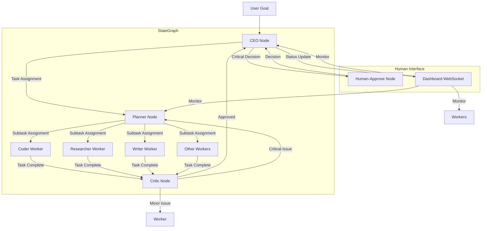

# StateGraph Design for Oracle Multi-Agent

## Overview
From LangGraph StateGraph pattern and Soul-Brews Hierarchical Pattern, we design the orchestration engine for oracle-multi-agent.

## Architecture Pattern
**Choice: Hierarchical Pattern (CEO → Planner → Worker)**
- Based on Soul-Brews Studio battle-tested pattern
- Aligns with current Mother agent role as manager
- Enables task distribution and coordination

## StateGraph Nodes

### 1. CEO Node (Manager Agent)
**Purpose:** Overall strategy and task delegation
**Responsibilities:**
- Receive user goals and requests
- Analyze complexity and requirements
- Delegate to Planner for task breakdown
- Monitor overall progress
- Handle human approval requests for critical decisions

**Inputs:**
- User goal/request
- Current system state
- Available agent pool

**Outputs:**
- Task assignment to Planner
- Approval requests to Human-Approve
- Status updates to Dashboard

---

### 2. Planner Node
**Purpose:** Task decomposition and planning
**Responsibilities:**
- Receive high-level task from CEO
- Break down into executable subtasks (2-5 min each)
- Assign appropriate worker agents based on skills
- Create execution plan with dependencies
- Validate plan completeness

**Inputs:**
- Task from CEO
- Available worker agents and their skills
- Project context

**Outputs:**
- Execution plan with subtasks
- Worker assignments
- Estimated completion time

---

### 3. Worker Nodes (Coder, Researcher, Writer, etc.)
**Purpose:** Execute specific subtasks
**Responsibilities:**
- Receive assigned subtask from Planner
- Execute using available tools
- Report progress and results
- Request help if blocked
- Complete subtask verification

**Types:**
- **Coder:** Code implementation, debugging, testing
- **Researcher:** Information gathering, analysis, documentation
- **Writer:** Content creation, documentation, reports
- **Data-Analyst:** Data processing, analysis, visualization
- **DevOps:** Deployment, infrastructure, CI/CD
- **QA-Tester:** Testing, quality assurance

**Inputs:**
- Subtask assignment
- Context and dependencies
- Tool access

**Outputs:**
- Task completion status
- Results/artifacts
- Error reports

---

### 4. Critic Node
**Purpose:** Quality assurance and review
**Responsibilities:**
- Review completed tasks against plan
- Identify issues by severity
- Block critical issues
- Suggest improvements
- Enforce TDD and code quality standards

**Inputs:**
- Completed task from Worker
- Original plan requirements
- Quality standards

**Outputs:**
- Review report with severity levels
- Approval or rejection
- Improvement suggestions

---

### 5. Human-Approve Node
**Purpose:** Human-in-the-loop for critical decisions
**Responsibilities:**
- Receive approval requests from CEO
- Review and approve/reject
- Provide guidance
- Override automated decisions if needed

**Inputs:**
- Approval request from CEO
- Context and rationale

**Outputs:**
- Approval/rejection decision
- Additional guidance

---

## StateGraph Flow (Mermaid Diagram)



---

## Shared State Schema

### AgentState
```typescript
interface AgentState {
  // Task Information
  currentGoal: string;
  currentTask: string | null;
  taskHistory: Task[];
  
  // Agent Information
  agentId: string;
  agentRole: string;
  agentStatus: 'idle' | 'active' | 'blocked' | 'error';
  
  // Communication
  messages: Message[];
  lastMessageFrom: string | null;
  
  // Progress
  progress: number; // 0-100
  startTime: number;
  estimatedCompletion: number;
  
  // Dependencies
  dependencies: string[];
  blockedBy: string | null;
  
  // Tools & Resources
  availableTools: string[];
  toolUsage: ToolUsage[];
  
  // Memory
  workingMemory: Record<string, any>;
  context: Record<string, any>;
}
```

### SystemState
```typescript
interface SystemState {
  // All Agents
  agents: Map<string, AgentState>;
  
  // Task Queue
  taskQueue: Task[];
  completedTasks: Task[];
  
  // Global Context
  projectContext: ProjectContext;
  userGoals: Goal[];
  
  // Orchestration State
  currentPhase: 'planning' | 'execution' | 'review' | 'complete';
  orchestratorState: 'idle' | 'active' | 'paused';
  
  // Human Interface
  pendingApprovals: ApprovalRequest[];
  dashboardState: DashboardState;
}
```

---

## State Transitions

### CEO Node Transitions
```
idle → active: Receive user goal
active → planning: Delegate to Planner
active → waiting_approval: Request human approval
waiting_approval → active: Receive approval
active → idle: Task complete
active → error: Critical failure
```

### Planner Node Transitions
```
idle → planning: Receive task from CEO
planning → assigning: Break down tasks
assigning → idle: All tasks assigned
planning → error: Cannot decompose task
```

### Worker Node Transitions
```
idle → active: Receive subtask
active → working: Executing subtask
working → review: Submit to Critic
review → idle: Task approved
review → working: Task rejected, fix issues
active → blocked: Waiting for dependency
blocked → active: Dependency resolved
active → error: Execution failure
```

### Critic Node Transitions
```
idle → reviewing: Receive completed task
reviewing → idle: Task approved
reviewing → requesting_fix: Task has issues
```

---

## Checkpoint Strategy

**From LangGraph Checkpoint + MAW Guide:**
- Save state after each node completion
- Save state before critical decisions (human approval)
- Save state periodically during long-running tasks
- Use OracleCheckpointer to persist to Oracle DB
- Enable resume from last checkpoint after crash

**Checkpoint Triggers:**
1. After CEO receives goal
2. After Planner creates plan
3. After Worker completes subtask
4. After Critic reviews task
5. Before human approval request
6. Every 30 seconds during long operations

---

## Error Handling

**From MAW Guide Circuit Breaker:**
- Track consecutive failures per agent
- Circuit breaker opens after 3 consecutive failures
- Open circuit: Agent paused, tasks rerouted
- Circuit closes after 60 seconds of cooldown
- Alert human when circuit opens

**Error Recovery:**
- Retry with exponential backoff (2s, 4s, 8s)
- Escalate to CEO if retry fails
- Request human intervention for critical errors
- Log all errors to episodic memory

---

## Implementation Notes

**From LangGraph:**
- Use StateGraph class from @langchain/langgraph
- Define nodes as functions
- Define edges as conditional transitions
- Use Command pattern for node communication
- Implement custom OracleCheckpointer

**From Soul-Brews:**
- Hierarchical pattern: CEO → Planner → Worker
- WebSocket streaming for real-time updates
- Human visibility through Dashboard
- Battle-tested from 100-hour production system

**From Superpowers:**
- Brainstorm → write-plan → execute workflow
- TDD with RED-GREEN-REFACTOR
- Critique Loop for quality
- Skills library for reusable capabilities
