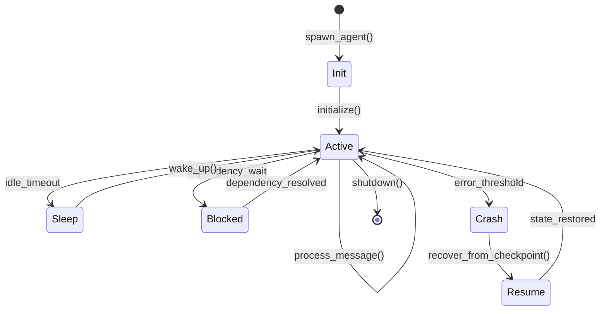
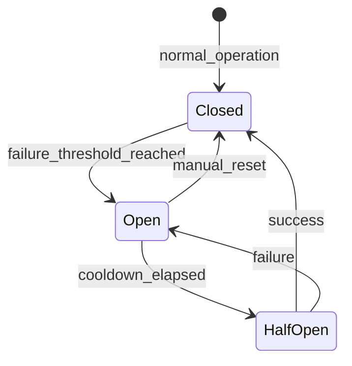

# MAW Lifecycle Design

## Overview
From MAW Guide lifecycle management and Circuit Breaker pattern, we design the agent lifecycle system for oracle-multi-agent.

## Lifecycle States

### State Diagram


### State Definitions

#### 1. Init State
**Purpose:** Agent initialization
**Transitions:**
- Enter: `spawn_agent()` called
- Exit: Initialize → Active

**Actions:**
- Load agent configuration from YAML
- Initialize LLM client
- Register with backend
- Load last checkpoint (if exists)
- Initialize memory layers

**Timeout:** 30 seconds (fail if initialization takes longer)

---

#### 2. Active State
**Purpose:** Agent processing messages and tasks
**Transitions:**
- Enter: Initialize / Resume / Wake / Unblock
- Exit: Sleep / Blocked / Crash / Shutdown

**Actions:**
- Process incoming messages
- Execute tools
- Update state
- Save checkpoint periodically
- Send heartbeat

**Heartbeat Interval:** 10 seconds

---

#### 3. Sleep State
**Purpose:** Agent idle, conserving resources
**Transitions:**
- Enter: Idle timeout (no activity for X seconds)
- Exit: Wake up on message or task

**Actions:**
- Pause message processing
- Maintain registration with backend
- Listen for wake signal
- Minimal resource usage

**Idle Timeout:** Configurable per agent (default: 300 seconds)

---

#### 4. Blocked State
**Purpose:** Agent waiting for dependency or external resource
**Transitions:**
- Enter: Dependency unavailable
- Exit: Dependency resolved

**Actions:**
- Pause execution
- Monitor dependency
- Auto-resume when available
- Alert if blocked too long

**Block Timeout:** 60 seconds (escalate to human)

---

#### 5. Crash State
**Purpose:** Agent encountered unrecoverable error
**Transitions:**
- Enter: Error threshold exceeded
- Exit: Resume from checkpoint

**Actions:**
- Log error to episodic memory
- Save emergency checkpoint
- Notify orchestrator
- Attempt recovery

**Error Threshold:** 3 consecutive errors

---

#### 6. Resume State
**Purpose:** Recovering from crash using checkpoint
**Transitions:**
- Enter: Crash recovery initiated
- Exit: Active (state restored)

**Actions:**
- Load latest checkpoint
- Restore agent state
- Restore memory layers
- Resume from last operation
- Notify orchestrator of recovery

---

## Circuit Breaker Pattern

### Circuit Breaker States


### Circuit Breaker Implementation
```typescript
/**
 * Circuit Breaker for Agent Safety
 * From MAW Guide Circuit Breaker pattern
 */

interface CircuitBreakerConfig {
  failureThreshold: number;      // Failures before opening
  cooldownPeriod: number;         // Milliseconds before half-open
  successThreshold: number;       // Successes before closing
  timeout: number;                // Operation timeout
}

enum CircuitState {
  CLOSED = 'closed',    // Normal operation
  OPEN = 'open',        // Circuit open, reject calls
  HALF_OPEN = 'half_open' // Testing if recovered
}

class CircuitBreaker {
  private state: CircuitState = CircuitState.CLOSED;
  private failureCount: number = 0;
  private successCount: number = 0;
  private lastFailureTime: number = 0;
  private config: CircuitBreakerConfig;

  constructor(config: CircuitBreakerConfig) {
    this.config = config;
  }

  /**
   * Execute operation with circuit breaker
   */
  async execute<T>(operation: () => Promise<T>): Promise<T> {
    // Check circuit state
    if (this.state === CircuitState.OPEN) {
      if (this.shouldAttemptReset()) {
        this.state = CircuitState.HALF_OPEN;
      } else {
        throw new Error('Circuit breaker is OPEN');
      }
    }

    try {
      // Execute operation with timeout
      const result = await this.withTimeout(operation, this.config.timeout);
      
      // Success
      this.onSuccess();
      return result;
    } catch (error) {
      // Failure
      this.onFailure();
      throw error;
    }
  }

  /**
   * Handle successful operation
   */
  private onSuccess(): void {
    this.failureCount = 0;
    
    if (this.state === CircuitState.HALF_OPEN) {
      this.successCount++;
      
      if (this.successCount >= this.config.successThreshold) {
        this.state = CircuitState.CLOSED;
        this.successCount = 0;
      }
    }
  }

  /**
   * Handle failed operation
   */
  private onFailure(): void {
    this.failureCount++;
    this.lastFailureTime = Date.now();
    this.successCount = 0;

    if (this.failureCount >= this.config.failureThreshold) {
      this.state = CircuitState.OPEN;
      console.warn(`Circuit breaker OPEN after ${this.failureCount} failures`);
    }
  }

  /**
   * Check if should attempt reset
   */
  private shouldAttemptReset(): boolean {
    return Date.now() - this.lastFailureTime >= this.config.cooldownPeriod;
  }

  /**
   * Execute with timeout
   */
  private async withTimeout<T>(
    operation: () => Promise<T>,
    timeout: number
  ): Promise<T> {
    return Promise.race([
      operation(),
      new Promise<T>((_, reject) => 
        setTimeout(() => reject(new Error('Operation timeout')), timeout)
      )
    ]);
  }

  /**
   * Manual reset
   */
  reset(): void {
    this.state = CircuitState.CLOSED;
    this.failureCount = 0;
    this.successCount = 0;
  }

  getState(): CircuitState {
    return this.state;
  }
}
```

### Circuit Breaker Per Agent
```typescript
/**
 * Circuit Breaker Manager for all agents
 */
class CircuitBreakerManager {
  private breakers: Map<string, CircuitBreaker> = new Map();

  /**
   * Get or create circuit breaker for agent
   */
  getBreaker(agentId: string): CircuitBreaker {
    if (!this.breakers.has(agentId)) {
      const config: CircuitBreakerConfig = {
        failureThreshold: 3,
        cooldownPeriod: 60000, // 1 minute
        successThreshold: 2,
        timeout: 30000 // 30 seconds
      };
      this.breakers.set(agentId, new CircuitBreaker(config));
    }
    return this.breakers.get(agentId)!;
  }

  /**
   * Execute with circuit breaker
   */
  async execute(agentId: string, operation: () => Promise<any>): Promise<any> {
    const breaker = this.getBreaker(agentId);
    return breaker.execute(operation);
  }

  /**
   * Reset circuit breaker for agent
   */
  reset(agentId: string): void {
    const breaker = this.breakers.get(agentId);
    if (breaker) {
      breaker.reset();
    }
  }

  /**
   * Get all circuit breaker states
   */
  getAllStates(): Map<string, CircuitState> {
    const states = new Map<string, CircuitState>();
    for (const [agentId, breaker] of this.breakers.entries()) {
      states.set(agentId, breaker.getState());
    }
    return states;
  }
}
```

---

## Auto-Register Agent Service

### Registration Loop
```typescript
/**
 * Auto-register Agent Service with Backend
 * From .windsurfrules: Agent Service ต้อง auto-register กับ Backend ทุก 10 วิ
 */

class AgentServiceRegistrar {
  private backendUrl: string;
  private serviceUrl: string;
  private agentConfig: AgentConfig;
  private registrationInterval: NodeJS.Timeout | null = null;

  constructor(backendUrl: string, serviceUrl: string, agentConfig: AgentConfig) {
    this.backendUrl = backendUrl;
    this.serviceUrl = serviceUrl;
    this.agentConfig = agentConfig;
  }

  /**
   * Start auto-registration loop
   */
  startAutoRegister(): void {
    console.log(`Starting auto-register for ${this.agentConfig.name}`);
    
    // Initial registration
    this.register();

    // Register every 10 seconds
    this.registrationInterval = setInterval(() => {
      this.register();
    }, 10000);
  }

  /**
   * Stop auto-registration
   */
  stopAutoRegister(): void {
    if (this.registrationInterval) {
      clearInterval(this.registrationInterval);
      this.registrationInterval = null;
    }
    
    // Unregister from backend
    this.unregister();
  }

  /**
   * Register with backend
   */
  private async register(): Promise<void> {
    try {
      const response = await fetch(
        `${this.backendUrl}/api/v2/agents/register`,
        {
          method: 'POST',
          headers: { 'Content-Type': 'application/json' },
          body: JSON.stringify({
            id: this.agentConfig.id,
            name: this.agentConfig.name,
            role: this.agentConfig.role,
            personality: this.agentConfig.personality || '',
            serviceUrl: this.serviceUrl,
            status: 'running'
          })
        }
      );

      if (response.ok) {
        console.log(`✅ ${this.agentConfig.name} registered with backend`);
      } else {
        console.warn(`⚠️ Registration failed: ${response.status}`);
      }
    } catch (error) {
      console.error(`❌ Registration error: ${error.message}`);
    }
  }

  /**
   * Unregister from backend
   */
  private async unregister(): Promise<void> {
    try {
      await fetch(
        `${this.backendUrl}/api/v2/agents/${this.agentConfig.id}/unregister`,
        { method: 'POST' }
      );
      console.log(`✅ ${this.agentConfig.name} unregistered from backend`);
    } catch (error) {
      console.error(`❌ Unregistration error: ${error.message}`);
    }
  }
}
```

### Heartbeat Mechanism
```typescript
/**
 * Heartbeat to keep agent alive in backend
 */
class HeartbeatService {
  private backendUrl: string;
  private agentId: string;
  private heartbeatInterval: NodeJS.Timeout | null = null;

  constructor(backendUrl: string, agentId: string) {
    this.backendUrl = backendUrl;
    this.agentId = agentId;
  }

  /**
   * Start heartbeat
   */
  startHeartbeat(interval: number = 10000): void {
    console.log(`Starting heartbeat for ${this.agentId}`);
    
    this.heartbeatInterval = setInterval(() => {
      this.sendHeartbeat();
    }, interval);
  }

  /**
   * Stop heartbeat
   */
  stopHeartbeat(): void {
    if (this.heartbeatInterval) {
      clearInterval(this.heartbeatInterval);
      this.heartbeatInterval = null;
    }
  }

  /**
   * Send heartbeat to backend
   */
  private async sendHeartbeat(): Promise<void> {
    try {
      await fetch(
        `${this.backendUrl}/api/v2/agents/${this.agentId}/heartbeat`,
        { method: 'POST' }
      );
    } catch (error) {
      console.error(`Heartbeat error: ${error.message}`);
    }
  }
}
```

---

## Lifecycle Manager

### Complete Lifecycle Implementation
```typescript
/**
 * Agent Lifecycle Manager
 * From MAW Guide lifecycle pattern
 */

class AgentLifecycleManager {
  private agentId: string;
  private state: LifecycleState = LifecycleState.Init;
  private circuitBreaker: CircuitBreaker;
  private registrar: AgentServiceRegistrar;
  private heartbeat: HeartbeatService;
  private checkpointer: OracleCheckpointer;

  constructor(
    agentConfig: AgentConfig,
    backendUrl: string,
    serviceUrl: string
  ) {
    this.agentId = agentConfig.id;
    this.circuitBreaker = new CircuitBreaker({
      failureThreshold: 3,
      cooldownPeriod: 60000,
      successThreshold: 2,
      timeout: 30000
    });
    this.registrar = new AgentServiceRegistrar(backendUrl, serviceUrl, agentConfig);
    this.heartbeat = new HeartbeatService(backendUrl, agentConfig.id);
    this.checkpointer = new OracleCheckpointer(db, agentConfig.id);
  }

  /**
   * Initialize agent
   */
  async initialize(): Promise<void> {
    this.state = LifecycleState.Init;
    
    try {
      // Load configuration
      await this.loadConfig();
      
      // Initialize LLM client
      await this.initializeLLM();
      
      // Register with backend
      this.registrar.startAutoRegister();
      
      // Start heartbeat
      this.heartbeat.startHeartbeat();
      
      // Load checkpoint if exists
      await this.loadCheckpoint();
      
      // Transition to Active
      this.state = LifecycleState.Active;
      
      console.log(`✅ ${this.agentId} initialized and active`);
    } catch (error) {
      this.state = LifecycleState.Crash;
      console.error(`❌ Initialization failed: ${error.message}`);
      throw error;
    }
  }

  /**
   * Process message with circuit breaker
   */
  async processMessage(message: string): Promise<string> {
    if (this.state !== LifecycleState.Active) {
      throw new Error(`Agent not in active state: ${this.state}`);
    }

    return this.circuitBreaker.execute(async () => {
      // Save checkpoint before processing
      await this.saveCheckpoint();

      // Process message
      const response = await this.agentProcess(message);

      // Save checkpoint after processing
      await this.saveCheckpoint();

      return response;
    });
  }

  /**
   * Handle crash
   */
  async handleCrash(error: Error): Promise<void> {
    this.state = LifecycleState.Crash;
    
    console.error(`💥 Agent crashed: ${error.message}`);
    
    // Save emergency checkpoint
    await this.saveEmergencyCheckpoint();
    
    // Log to episodic memory
    await this.logError(error);

    // Attempt recovery
    await this.recover();
  }

  /**
   * Recover from crash
   */
  private async recover(): Promise<void> {
    this.state = LifecycleState.Resume;
    
    try {
      // Load latest checkpoint
      await this.loadCheckpoint();
      
      // Restore state
      this.state = LifecycleState.Active;
      
      // Reset circuit breaker
      this.circuitBreaker.reset();
      
      console.log(`✅ ${this.agentId} recovered from crash`);
    } catch (error) {
      console.error(`❌ Recovery failed: ${error.message}`);
      // Notify human for manual intervention
      await this.notifyHuman('Recovery failed, manual intervention required');
    }
  }

  /**
   * Shutdown agent
   */
  async shutdown(): Promise<void> {
    this.state = LifecycleState.Shutdown;
    
    // Stop auto-register
    this.registrar.stopAutoRegister();
    
    // Stop heartbeat
    this.heartbeat.stopHeartbeat();
    
    // Save final checkpoint
    await this.saveCheckpoint();
    
    console.log(`✅ ${this.agentId} shut down gracefully`);
  }

  /**
   * Save checkpoint
   */
  private async saveCheckpoint(): Promise<void> {
    const state = this.getCurrentState();
    await this.checkpointer.put(
      { configurable: { thread_id: this.agentId } },
      state,
      { timestamp: Date.now(), state: this.state }
    );
  }

  /**
   * Load checkpoint
   */
  private async loadCheckpoint(): Promise<void> {
    const checkpoint = await this.checkpointer.get({
      configurable: { thread_id: this.agentId }
    });

    if (checkpoint) {
      this.restoreState(checkpoint.checkpoint);
      console.log(`✅ Loaded checkpoint for ${this.agentId}`);
    }
  }

  /**
   * Get current lifecycle state
   */
  getState(): LifecycleState {
    return this.state;
  }

  /**
   * Get circuit breaker state
   */
  getCircuitState(): CircuitState {
    return this.circuitBreaker.getState();
  }
}

enum LifecycleState {
  Init = 'init',
  Active = 'active',
  Sleep = 'sleep',
  Blocked = 'blocked',
  Crash = 'crash',
  Resume = 'resume',
  Shutdown = 'shutdown'
}
```

---

## Error Handling & Recovery

### Error Classification
```typescript
enum ErrorSeverity {
  MINOR = 'minor',      // Retry once
  MAJOR = 'major',      // Retry with backoff
  CRITICAL = 'critical' // Escalate to human
}

class ErrorHandler {
  /**
   * Classify error severity
   */
  static classify(error: Error): ErrorSeverity {
    // Timeout errors
    if (error.message.includes('timeout')) {
      return ErrorSeverity.MAJOR;
    }

    // Network errors
    if (error.message.includes('ECONNREFUSED') || error.message.includes('ENOTFOUND')) {
      return ErrorSeverity.MAJOR;
    }

    // Validation errors
    if (error.message.includes('validation') || error.message.includes('invalid')) {
      return ErrorSeverity.MINOR;
    }

    // Default to critical
    return ErrorSeverity.CRITICAL;
  }

  /**
   * Handle error based on severity
   */
  static async handle(error: Error, agentId: string): Promise<void> {
    const severity = this.classify(error);

    switch (severity) {
      case ErrorSeverity.MINOR:
        // Log and continue
        console.warn(`[MINOR] ${agentId}: ${error.message}`);
        break;

      case ErrorSeverity.MAJOR:
        // Retry with backoff
        console.error(`[MAJOR] ${agentId}: ${error.message}`);
        await this.retryWithBackoff(error, agentId);
        break;

      case ErrorSeverity.CRITICAL:
        // Escalate to human
        console.error(`[CRITICAL] ${agentId}: ${error.message}`);
        await this.escalateToHuman(error, agentId);
        break;
    }
  }

  /**
   * Retry with exponential backoff
   */
  private static async retryWithBackoff(error: Error, agentId: string): Promise<void> {
    const delays = [2000, 4000, 8000]; // 2s, 4s, 8s

    for (const delay of delays) {
      await new Promise(resolve => setTimeout(resolve, delay));
      // Retry logic here
    }
  }

  /**
   * Escalate to human
   */
  private static async escalateToHuman(error: Error, agentId: string): Promise<void> {
    // Send notification to human
    await fetch('/api/v2/alerts', {
      method: 'POST',
      headers: { 'Content-Type': 'application/json' },
      body: JSON.stringify({
        agent_id: agentId,
        severity: 'critical',
        message: error.message,
        timestamp: Date.now()
      })
    });
  }
}
```

---

## Monitoring & Observability

### Metrics to Track
```typescript
interface AgentMetrics {
  agent_id: string;
  state: LifecycleState;
  circuit_state: CircuitState;
  uptime: number;
  messages_processed: number;
  errors_count: number;
  last_heartbeat: number;
  checkpoint_count: number;
  memory_usage: number;
}
```

### Health Check Endpoint
```typescript
/**
 * Health check endpoint for agent
 */
app.get('/health', (req, res) => {
  const metrics = lifecycleManager.getMetrics();
  
  res.json({
    status: metrics.state === LifecycleState.Active ? 'healthy' : 'unhealthy',
    metrics,
    timestamp: Date.now()
  });
});
```

---

## Integration with Persistent Agent Service

### agent-service.js Integration
```javascript
/**
 * Integrate lifecycle management into agent-service.js
 */
const lifecycleManager = new AgentLifecycleManager(
  config,
  config.backendUrl,
  `http://localhost:${config.port}`
);

// Initialize on startup
lifecycleManager.initialize();

// Register with auto-registration
lifecycleManager.registrar.startAutoRegister();

// Handle shutdown gracefully
process.on('SIGTERM', async () => {
  await lifecycleManager.shutdown();
  process.exit(0);
});
```
